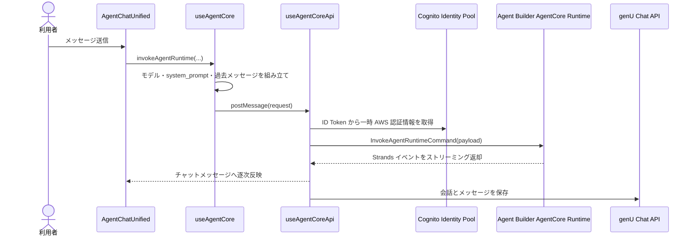

# genU のチャット実行経路：RAG Chat と AgentCore Runtime

## 目的

genU のチャット機能が、どのバックエンドを経由して生成 AI を呼び出すかを整理する。
特に RAG Chat と Agent Builder の違い、Agent Builder 画面から AgentCore Runtime までの呼び出し、
送信 payload、システムプロンプト、会話履歴、セッションの扱いをコードベースから確認する。

| 項目            | 値                             |
| --------------- | ------------------------------ |
| genU バージョン | v5.4.0                         |
| 調査コミット    | `0beb1991`                     |
| 調査日          | 2026-07-18                     |
| 主な調査対象    | `packages/web`、`packages/cdk` |

## 1. 先に結論

genU のすべてのチャットが AgentCore Runtime を使うわけではない。
画面・ユースケースによって、次の複数の実行経路を使い分けている。

| 機能                      | 主なフロントエンド経路                 | LLM・Agent の実行先                       |
| ------------------------- | -------------------------------------- | ----------------------------------------- |
| 通常チャット              | `useChat` → `useChatApi.predictStream` | genU のストリーミング Lambda → Bedrock    |
| Use Case Builder          | `useChat` → `useChatApi.predictStream` | genU のストリーミング Lambda → Bedrock    |
| 要約、翻訳など            | `useChat` 系                           | Lambda または各機能専用 API → Bedrock     |
| RAG Chat (Knowledge Base) | `useChat` → `useChatApi.predictStream` | PredictStream Lambda → Bedrock KB         |
| 従来の Bedrock Agent Chat | `useChat.postChat`                     | ストリーミング Lambda → Bedrock Agent     |
| MCP Chat                  | `useMcpApi`                            | MCP 用 Lambda エンドポイント              |
| Agent Builder             | `useAgentCore` → `useAgentCoreApi`     | Agent Builder 専用 AgentCore Runtime      |
| AgentCore 画面            | `useAgentCore` → `useAgentCoreApi`     | Generic または External AgentCore Runtime |
| Research Agent            | `useResearchAgent` → `useAgentCoreApi` | Research 専用 AgentCore Runtime           |

`useChat` はチャット画面の状態、モデル、会話履歴、DynamoDB への履歴保存などにも使われる。
AgentCore 系も状態管理には `useChat` を利用するため、`useChat` を使っているかどうかだけでは
実際の Runtime を判別できない。AgentCore を直接呼ぶ経路かどうかは、最終的に
`useAgentCoreApi` の `InvokeAgentRuntimeCommand` を使っているかで判断できる。

### 1.1 RAG Chat と Agent Builder の比較

RAG Chat の実装には `BedrockAgentRuntimeClient` という名前のクライアントが登場するが、
これは **Amazon Bedrock Knowledge Bases や Bedrock Agents のデータプレーンを呼ぶための SDK クライアント**
であり、AgentCore Runtime を意味しない。

| 項目                             | RAG Chat                                | Agent Builder                       |
| -------------------------------- | --------------------------------------- | ----------------------------------- |
| SDK                              | `@aws-sdk/client-bedrock-agent-runtime` | `@aws-sdk/client-bedrock-agentcore` |
| クライアント                     | `BedrockAgentRuntimeClient`             | `BedrockAgentCoreClient`            |
| コマンド                         | `RetrieveAndGenerateStreamCommand`      | `InvokeAgentRuntimeCommand`         |
| 呼び出し先                       | Bedrock Knowledge Bases                 | AgentCore Runtime                   |
| `AWS::BedrockAgentCore::Runtime` | 不要                                    | 使用する                            |
| 実行主体                         | genU の PredictStream Lambda            | ブラウザから直接呼び出し            |

両方に `Agent` や `Runtime` という語が含まれるため混同しやすいが、判別するときは SDK パッケージと
コマンドを見るとよい。`@aws-sdk/client-bedrock-agent-runtime` の
`RetrieveAndGenerateStreamCommand` は Knowledge Base の検索・回答生成 API である。一方、
`@aws-sdk/client-bedrock-agentcore` の `InvokeAgentRuntimeCommand` は
`AWS::BedrockAgentCore::Runtime` としてデプロイされた Runtime を呼び出す。

呼び出し主体も異なる。RAG Chat はブラウザから genU の PredictStream Lambda を呼び、Lambda の実行ロールで
Knowledge Base API を実行する。Agent Builder は Cognito Identity Pool の一時クレデンシャルを使い、
ブラウザから AgentCore Runtime を直接呼び出す。

## 2. Agent Builder の構造

### 2.1 エージェントごとに Runtime が作られるわけではない

Agent Builder でユーザーが作成するエージェントは、個別の AgentCore Runtime ではなく、
DynamoDB に保存される設定データである。主な設定は次のとおり。

- エージェント名、説明
- システムプロンプト
- モデル ID
- 利用する MCP Server
- コード実行の有効・無効
- 公開設定、タグ

`agentBuilderEnabled: true` でデプロイされる Agent Builder 専用 Runtime は共有であり、
複数の Agent Builder エージェントが同じ Runtime ARN を呼び出す。
エージェントごとの差は、呼び出しごとに渡す `system_prompt`、`model`、`mcp_servers`、
`agent_id`、`code_execution_enabled` などで表現される。

```text
Agent A ─┐  system_prompt=A、mcp_servers=[...]
Agent B ─┼──────────────────────────────────────┐
Agent C ─┘  system_prompt=C、model=...          │
                                                 ▼
                              Agent Builder 共有 AgentCore Runtime
```

したがって、エージェントを新規作成・編集しても通常は AgentCore Runtime の再デプロイは発生しない。
Runtime の実装や CDK 設定そのものを変更した場合にのみ再デプロイが必要になる。

### 2.2 Runtime 設定の取得

フロントエンドは、ビルド時に設定された次の環境変数から Runtime 情報を取得する。

| 環境変数                                    | 用途                         |
| ------------------------------------------- | ---------------------------- |
| `VITE_APP_AGENT_CORE_AGENT_BUILDER_RUNTIME` | Agent Builder の共有 Runtime |
| `VITE_APP_AGENT_CORE_GENERIC_RUNTIME`       | genU 付属の Generic Runtime  |
| `VITE_APP_AGENT_CORE_EXTERNAL_RUNTIMES`     | 登録済みの外部 Runtime 一覧  |

Agent Builder は `getAgentBuilderRuntime()` で専用 Runtime を取得し、取得できない場合は
`No AgentBuilder runtime available` として送信を中止する。

## 3. Agent Builder の呼び出しフロー

### 3.1 全体フロー



重要な点は、API Gateway や genU の呼び出し代理 Lambda を経由せず、ブラウザが
Cognito Identity Pool の一時クレデンシャルを使って AgentCore Runtime を直接呼ぶことである。
認証済みロールには対象 Runtime に対する `bedrock-agentcore:InvokeAgentRuntime` 権限が必要になる。

### 3.2 画面側の処理

対象は
[AgentChatUnified.tsx](../packages/web/src/components/agentBuilder/AgentChatUnified.tsx) である。

1. `AgentBuilderChatPage` が Agent API からエージェント設定を取得する。
2. `AgentChatUnified` がエージェントの `modelId` をチャット状態へ設定する。
3. `agent.systemPrompt` に名前と説明を付加し、`updateSystemContext()` へ設定する。
4. 利用者が送信すると、Agent Builder 専用 Runtime ARN を取得する。
5. 添付ファイルから、エラーやアップロード中のファイルを除外する。
6. `invokeAgentRuntime()` に現在の入力とエージェント設定を渡す。

現在のシステムプロンプトは概ね次の形になる。

```text
<agent.systemPrompt>

Agent Name: <agent.name>
Agent Description: <agent.description>

Please respond as this agent with the specified behavior and personality.
```

通常画面と編集画面のテスターは、どちらも `AgentChatUnified` を利用する。
編集画面の `AgentTester` は編集中のフォーム値から一時的な `AgentConfiguration` を作るため、
保存前のシステムプロンプトや MCP 設定でも同じ呼び出し経路をテストできる。

### 3.3 `useAgentCore` の処理

対象は [useAgentCore.ts](../packages/web/src/hooks/useAgentCore.ts) である。

`invokeAgentRuntime()` は次を行う。

1. 画面指定またはチャット状態のモデル ID から `Model` を解決する。
2. `useChat.rawMessages` から過去メッセージを取得する。
3. system ロールと空の assistant メッセージを除外する。
4. `getCurrentSystemContext()` の内容を `system_prompt` に設定する。
5. 現在のユーザー入力を `prompt` に設定する。
6. Runtime ARN、session ID、ファイル、MCP Server などとともに `useAgentCoreApi` へ渡す。

system メッセージを過去メッセージから除外するのは、同じ内容を `system_prompt` として
別フィールドで送るためである。

### 3.4 `useAgentCoreApi` の処理

対象は [useAgentCoreApi.ts](../packages/web/src/hooks/useAgentCoreApi.ts) である。

1. 現在のユーザー入力と、応答待ちの assistant メッセージを画面状態へ追加する。
2. Amplify の `fetchAuthSession()` で Cognito ID Token を取得する。
3. `fromCognitoIdentityPool()` で AWS の一時クレデンシャルを取得する。
4. Runtime ARN からリージョンを抽出し、`BedrockAgentCoreClient` を生成する。
5. 過去メッセージと添付ファイルを Strands 形式へ変換する。
6. `AgentCoreRequest` を JSON 化して `InvokeAgentRuntimeCommand` を実行する。
7. 応答ストリームを1行ずつ `StrandsStreamProcessor` へ渡す。
8. 生成完了後、通常の Chat API を使って会話履歴を保存する。

AgentCore の実行と会話履歴の永続化は別経路である。LLM 応答は AgentCore Runtime から直接受け取り、
履歴は genU の `chats` API を通して従来どおり保存する。

## 4. Agent Builder が送る payload

実際の payload は概ね次の形式になる。

```json
{
  "messages": [
    {
      "role": "user",
      "content": [{ "text": "前の質問" }]
    },
    {
      "role": "assistant",
      "content": [{ "text": "前の回答" }]
    }
  ],
  "system_prompt": "エージェント固有のシステムプロンプト",
  "prompt": [{ "text": "現在の質問" }],
  "model": {
    "type": "bedrock",
    "modelId": "<選択したモデルID>",
    "region": "<モデルのリージョン>"
  },
  "user_id": "current-user",
  "mcp_servers": ["<MCP Server名>"],
  "agent_id": "<Agent BuilderのagentId>",
  "session_id": "<UUID>",
  "code_execution_enabled": false
}
```

### 各フィールドの由来

| フィールド               | 由来・意味                                                  |
| ------------------------ | ----------------------------------------------------------- |
| `messages`               | `useChat` が保持する過去の user / assistant メッセージ      |
| `system_prompt`          | `AgentChatUnified` が設定した system context                |
| `prompt`                 | 現在の入力。添付ファイルも Strands content block として追加 |
| `model`                  | Agent Builder 画面で選択中のモデル                          |
| `user_id`                | 現実装では `current-user`                                   |
| `mcp_servers`            | エージェントに保存された MCP Server 名の配列                |
| `agent_id`               | Agent Builder で発行されたエージェント ID                   |
| `session_id`             | `AgentChatUnified` のマウント時に生成する UUID              |
| `code_execution_enabled` | エージェントのコード実行設定                                |

`AgentChatUnified` の「チャットをクリア」は、画面上のメッセージとファイルを消去するが、
現在の実装ではコンポーネントを再マウントしない限り `session_id` 自体は変更しない。
一方、Runtime へは過去の `messages` も毎回明示的に送信しているため、会話文脈は
Runtime 内部のセッションだけに依存していない。

## 5. ストリーミング応答

AgentCore Runtime からは Strands のイベント形式が返る。
フロントエンドはレスポンスを改行単位で処理し、`data: ` で始まる場合は SSE の prefix を除去する。

代表的なテキストイベントは次の形式である。

```json
{
  "event": {
    "contentBlockDelta": {
      "delta": {
        "text": "回答の一部"
      }
    }
  }
}
```

テキスト以外に trace や metadata も `StrandsStreamProcessor` で処理し、チャットメッセージへ反映する。
外部 Runtime を登録する場合も、この入出力形式との互換性が必要になる。

## 6. AgentCore を使わない主な経路

### 6.1 通常チャットと Use Case Builder

通常チャットや Use Case Builder は [useChat.ts](../packages/web/src/hooks/useChat.ts) の
`postChat()` を利用する。ストリーミング生成では
[useChatApi.ts](../packages/web/src/hooks/useChatApi.ts) の `predictStream()` が、
`VITE_APP_PREDICT_STREAM_FUNCTION_ARN` で指定された Lambda を
`InvokeWithResponseStreamCommand` で呼び出す。

```text
ChatPage / UseCaseBuilderView
  ↓ useChat.postChat
useChatApi.predictStream
  ↓ Lambda InvokeWithResponseStream
genU Predict Stream Lambda
  ↓
Amazon Bedrock
```

Use Case Builder のプレースホルダ解析とフォーム生成はブラウザ側で行われ、置換済みの
プロンプトがこの通常チャット経路へ送られる。AgentCore Runtime は使用しない。

### 6.2 RAG Chat (Knowledge Base)

RAG Chat は [RagKnowledgeBasePage.tsx](../packages/web/src/pages/RagKnowledgeBasePage.tsx) から
通常チャットと同じ `useChat.postChat()` を利用する。ただし送信時にモデル種別を `bedrockKb` へ上書きする。

```text
RagKnowledgeBasePage
  ↓ useChat.postChat(..., overrideModelType = "bedrockKb")
useChatApi.predictStream
  ↓ Lambda InvokeWithResponseStream
genU PredictStream Lambda
  ↓ api[model.type] により bedrockKbApi を選択
RetrieveAndGenerateStreamCommand
  ↓
Amazon Bedrock Knowledge Bases
  ├─ ベクトル検索
  ├─ 検索結果を使った回答生成
  └─ 回答と引用情報をストリーミング返却
```

PredictStream Lambda は [predictStream.ts](../packages/cdk/lambda/predictStream.ts) で
`api[model.type].invokeStream()` を呼ぶ。`model.type` が `bedrockKb` なので、
[bedrockKbApi.ts](../packages/cdk/lambda/utils/bedrockKbApi.ts) が選択される。
`bedrockKbApi` は、次の情報を `RetrieveAndGenerateStreamCommand` に設定する。

- 利用者の最新の質問
- Lambda 環境変数 `KNOWLEDGE_BASE_ID` の Knowledge Base ID
- 回答生成に使用するモデル ARN
- システムコンテキストから組み立てたプロンプトテンプレート
- 明示・暗黙のメタデータフィルター
- 任意のリランキング、Query Decomposition 設定
- Bedrock Knowledge Bases が発行したセッション ID

検索結果をブラウザや Lambda が手動で通常チャットのプロンプトへ連結するのではなく、現在の実装では
Bedrock Knowledge Bases の Retrieve and Generate API が検索、回答生成、引用生成を一括して実行する。
返されたセッション ID は画面側で保持され、次の質問で再送される。回答と引用は genU のストリーミング形式へ
変換してブラウザへ返し、会話履歴は通常チャットと同じ Chat API で DynamoDB に保存する。

#### Knowledge Base を利用可能にする構成

`ragKnowledgeBaseEnabled: true` にすると、フロントエンドに `/rag-knowledge-base` のルートとメニューが公開される。
Knowledge Base 自体は次のどちらかで用意する。

1. `ragKnowledgeBaseId` を指定する場合
   - 既存の Knowledge Base を利用する。
   - genU は Knowledge Base 用スタックを新規作成しない。
   - 指定した ID が PredictStream Lambda の `KNOWLEDGE_BASE_ID` に渡される。
2. `ragKnowledgeBaseId` を指定しない場合
   - CDK の [rag-knowledge-base-stack.ts](../packages/cdk/lib/rag-knowledge-base-stack.ts) が、
     S3 データソースバケット、OpenSearch Serverless のベクトルインデックス、Bedrock Knowledge Base、
     S3 データソース、Web Crawler データソースを作成する。
   - `packages/cdk/rag-docs` のサンプル文書は S3 へデプロイされる。
   - デプロイ後、Bedrock コンソールで各データソースを Sync し、文書の解析、分割、Embedding、
     ベクトルインデックスへの取り込みを完了させる必要がある。

したがって、問い合わせ時に RAG Chat が S3 オブジェクトを直接読み出しているわけではない。
S3 は Knowledge Base の取り込み元であり、問い合わせ時は Knowledge Base ID を指定して、
同期済みのベクトルインデックスを検索する。

なお、[useRagKnowledgeBase.ts](../packages/web/src/hooks/useRagKnowledgeBase.ts) には
`RetrieveCommand` で検索してから通常チャットへ検索結果を渡す旧方式が残っているが、ファイル先頭に
deprecated と明記されており、現在の `RagKnowledgeBasePage` では使用されていない。

### 6.3 MCP Chat

MCP Chat は [useMcpApi.ts](../packages/web/src/hooks/useMcpApi.ts) を利用する。
Cognito の一時クレデンシャルで MCP 用 Lambda エンドポイントへの HTTP リクエストを SigV4 署名し、
レスポンスストリームを直接読み取る。これも AgentCore Runtime 呼び出しではない。

## 7. システムプロンプトのプレースホルダ対応への示唆

Agent Builder の `system_prompt` は固定値として Runtime 内に埋め込まれているのではなく、
ブラウザから呼び出しごとに渡される。そのため、Use Case Builder と同様のプレースホルダを
Agent Builder に追加する場合、基本的にはフロントエンドだけで実現できる。

想定フローは次のとおり。

```text
agent.systemPrompt
  ↓ プレースホルダ解析
Agent Builder のチャット画面に入力フォームを表示
  ↓ 利用者が値を確定
プレースホルダを入力値へ置換
  ↓ updateSystemContext
置換済み system_prompt を InvokeAgentRuntime payload に設定
```

最小構成では、次の変更は不要である。

- Agent Builder の DynamoDB スキーマ変更
- Agent 作成・更新 API の変更
- AgentCore Runtime の request schema 変更
- AgentCore Runtime の Python 実装変更
- エージェントごとの Runtime 作成

一方、`AgentChatUnified` には `agent.systemPrompt` を system context へ設定する初期化・更新処理がある。
フォームで置換したあとに元のテンプレートで上書きされないよう、両方の処理を置換済みプロンプトへ
統一する必要がある。また、会話途中で値を変更すると同じ履歴内でシステムプロンプトが変わるため、
値の変更時はチャットをクリアしてから再適用する設計が安全である。

## 8. 主なコード位置

| 役割                             | ファイル                                                                                 |
| -------------------------------- | ---------------------------------------------------------------------------------------- |
| Agent Builder チャット画面       | [AgentChatUnified.tsx](../packages/web/src/components/agentBuilder/AgentChatUnified.tsx) |
| Agent Builder 編集時テスター     | [AgentTester.tsx](../packages/web/src/components/agentBuilder/AgentTester.tsx)           |
| AgentCore リクエスト組み立て     | [useAgentCore.ts](../packages/web/src/hooks/useAgentCore.ts)                             |
| AgentCore SDK 呼び出し・応答処理 | [useAgentCoreApi.ts](../packages/web/src/hooks/useAgentCoreApi.ts)                       |
| 通常チャットの状態・送信         | [useChat.ts](../packages/web/src/hooks/useChat.ts)                                       |
| 通常チャットの Lambda 呼び出し   | [useChatApi.ts](../packages/web/src/hooks/useChatApi.ts)                                 |
| RAG Chat 画面                    | [RagKnowledgeBasePage.tsx](../packages/web/src/pages/RagKnowledgeBasePage.tsx)           |
| RAG の検索・回答生成             | [bedrockKbApi.ts](../packages/cdk/lambda/utils/bedrockKbApi.ts)                          |
| ストリーミング Lambda の入口     | [predictStream.ts](../packages/cdk/lambda/predictStream.ts)                              |
| Knowledge Base の CDK            | [rag-knowledge-base-stack.ts](../packages/cdk/lib/rag-knowledge-base-stack.ts)           |
| 旧 RAG Knowledge Base Hook       | [useRagKnowledgeBase.ts](../packages/web/src/hooks/useRagKnowledgeBase.ts)               |
| Agent Builder の型定義           | [agent-builder.d.ts](../packages/types/src/agent-builder.d.ts)                           |
| AgentCore payload の型定義       | [agent-core.d.ts](../packages/types/src/agent-core.d.ts)                                 |
| Agent Builder Runtime の CDK     | [generic-agent-core.ts](../packages/cdk/lib/construct/generic-agent-core.ts)             |
| Agent Builder Runtime の実装     | [generic-agent-core-runtime](../packages/cdk/lambda-python/generic-agent-core-runtime/)  |
