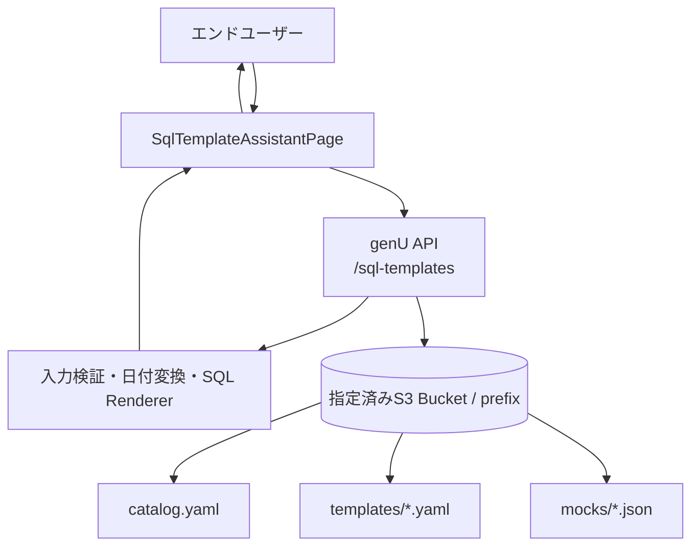

# SQL作成アシスタント 実装計画

## 1. 目的

genU に「SQL作成アシスタント」という独立メニューを追加する。
エンドユーザーは SQL や内部の日付形式を知らなくても、管理者が S3 に配置したテンプレートを選び、
画面上のフォームへ条件を入力して SQL を生成し、確認後にモック実行結果を表示できる。

対象フローは次のとおり。

```text
SQL雛形を選択
  ↓
S3のYAML定義を取得
  ↓
定義に応じた入力フォームを表示
  ↓
入力値を検証
  ├─ エラーあり → 項目別にエラーを表示して再入力
  └─ エラーなし
       ↓
日付などを内部形式へ変換してSQLを生成
       ↓
生成SQLを表示して実行確認
  ├─ 修正 → 入力フォームへ戻る
  └─ 実行
       ↓
モック実行結果を表形式で表示
```

## 2. 確定した設計方針

### 2.1 genU上の位置づけ

SQL作成アシスタントは、ソースコードへ追加する組み込みユースケースとする。
Use Case Builderで作成するカスタムユースケースにはしない。

- URLは `/sql-template-assistant`
- サイドメニュー名は「SQL作成アシスタント」
- `App.tsx` へメニューを追加する
- `main.tsx` へ専用Routeを追加する
- エンドユーザーはYAML、システムプロンプト、フォーム定義を編集できない
- テンプレートの追加・変更はS3更新権限を持つ管理者だけが行う

### 2.2 Agent関連機能への非依存

v1は次に依存しない。

- Use Case Builder
- Agent Builder
- AgentCore Runtime
- External AgentCore Runtime
- MCP Server
- LLMによるSQL生成

画面はチャット形式で表示するが、業務処理はReactの状態機械と既存genU API Lambdaで
決定的に実行する。テンプレート選択、入力検証、日付変換、SQL生成、モック実行を
LLMの判断や応答形式に依存させない。

設定上は次の組み合わせを許可する。

```typescript
useCaseBuilderEnabled: false,
agentBuilderEnabled: false,
sqlTemplateAssistantEnabled: true,
```

Use Case BuilderやAgent Builderを別用途で有効にしていても、SQL作成アシスタントは独立して動作する。

### 2.3 S3の利用方式

CDKで専用Bucketを新規作成せず、管理者が指定した既存S3 Bucketの指定prefixを利用する。

```text
s3://<bucket>/<prefix>/
├── catalog.yaml
├── templates/
│   └── <template-id>.yaml
└── mocks/
    └── <template-id>.json
```

ブラウザにはS3権限を与えない。既存のgenU API LambdaがLambda実行ロールでS3を読み取る。
API Lambdaの権限は指定prefixの `s3:GetObject` に限定する。

### 2.4 v1のスコープ

v1で対応するものは次のとおり。

- 最大100件のテンプレート一覧
- キーワード検索とカテゴリー絞り込み
- `text`、`date`、`integer`、`decimal`、`select` の入力項目
- 必須、文字数、正規表現、数値範囲、選択肢、日付前後関係の検証
- 日付の出力形式変換
- SQL文字列リテラルのエスケープ
- SQLプレビューとコピー
- 実行前確認
- JSONファイルを利用したモック結果表示
- エラー時の再入力、雛形選択への戻り、最初からやり直す操作

v1では次を対象外とする。

- 実データベースへの接続・SQL実行
- LLMによるテンプレート推薦や値の補完
- 自然文からのSQL生成
- 任意コードや式言語をYAML内で実行する機能
- 識別子、テーブル名、カラム名、SQL断片のユーザー入力
- 途中状態と生成履歴のDynamoDB保存
- ブラウザ更新後の途中状態復元
- テンプレート単位のユーザー認可

## 3. システム構成



### 責務分担

| レイヤー            | 責務                                                      |
| ------------------- | --------------------------------------------------------- |
| React               | メニュー、フォーム、エラー、SQL確認、モック結果、状態遷移 |
| genU API Lambda     | S3取得、YAML検証、入力検証、日付変換、SQL生成、モック取得 |
| S3                  | 管理者が管理するcatalog、テンプレート、モックデータ       |
| Cognito/API Gateway | エンドユーザー認証とAPI保護                               |

SQL本文やモックオブジェクトのS3キーをクライアントから受け取らない。
サーバーが検証済みのtemplate IDと固定prefixからS3キーを組み立てる。

## 4. 設定とCDK変更

### 4.1 StackInput

`packages/cdk/lib/stack-input.ts` に次を追加する。

```typescript
sqlTemplateAssistantEnabled: z.boolean().default(false),
sqlTemplateAssistantBucketName: z.string().default(''),
sqlTemplateAssistantBucketRegion: z.string().default(''),
sqlTemplateAssistantPrefix: z
  .string()
  .default('genu/sql-template-assistant'),
```

次の整合性検証を追加する。

- enabledの場合はBucket名とregionを必須にする
- prefixは空文字を禁止する
- prefixの先頭と末尾の `/` は正規化して除去する
- prefixに `..`、空セグメント、制御文字を許可しない

`parameter.ts` の設定例は次とする。

```typescript
sqlTemplateAssistantEnabled: true,
sqlTemplateAssistantBucketName: 'company-shared-bucket',
sqlTemplateAssistantBucketRegion: 'ap-northeast-1',
sqlTemplateAssistantPrefix: 'genu/sql-template-assistant',
```

### 4.2 API Lambda

既存の `Api` Constructへ設定を渡し、API Lambdaへ次の環境変数を設定する。

```text
SQL_TEMPLATE_ASSISTANT_ENABLED=true
SQL_TEMPLATE_BUCKET_NAME=company-shared-bucket
SQL_TEMPLATE_BUCKET_REGION=ap-northeast-1
SQL_TEMPLATE_PREFIX=genu/sql-template-assistant
```

同一アカウントのS3に対して、Lambda実行ロールへ次の権限を付与する。

```json
{
  "Effect": "Allow",
  "Action": "s3:GetObject",
  "Resource": "arn:aws:s3:::company-shared-bucket/genu/sql-template-assistant/*"
}
```

catalogと各objectのキーは既知のため、`s3:ListBucket` は付与しない。

別アカウントBucketの場合は、genU側IAMに加えてBucket PolicyでもAPI Lambda実行ロールを許可する。
SSE-KMSの場合は `kms:Decrypt` とKMS Key Policyの許可を追加する。

### 4.3 Web

Web Constructへ次を渡す。

```text
VITE_APP_SQL_TEMPLATE_ASSISTANT_ENABLED=true
```

ローカルWeb開発でCloudFormation Outputから取得できるよう、次も追加する。

- `CfnOutput: SqlTemplateAssistantEnabled`
- `setup-env.sh` の `VITE_APP_SQL_TEMPLATE_ASSISTANT_ENABLED`
- Windows開発を維持する場合は `web_devw_win.ps1` の同等設定

Bucket名、region、prefixはブラウザへ公開せず、API Lambdaだけへ渡す。

### 4.4 dev環境のlocalhost CORS

ローカルViteは `http://localhost:5173` からデプロイ済みdev API Gatewayを呼び出す。
現在のAPI Lambdaの `ALLOWED_ORIGINS` はデプロイ済みCloudFront URLだけであるため、
そのままではExpressのCORS middlewareに拒否される。

`packages/cdk/lib/generative-ai-use-cases-stack.ts` で、既存の通常・閉域向け `allowedOrigins` を
組み立てた後、`api.apiHandler.addEnvironment()` の直前に、`dev` の場合だけlocalhostを追加する。

```typescript
if (params.env === 'dev') {
  allowedOrigins.push('http://localhost:5173');
}

api.apiHandler.addEnvironment('ALLOWED_ORIGINS', allowedOrigins.join(','));
```

期待値は次のとおり。

| 環境      | 許可するOrigin                               |
| --------- | -------------------------------------------- |
| `dev`     | デプロイ済みWeb URL、`http://localhost:5173` |
| `staging` | デプロイ済みWeb URLだけ                      |
| `prod`    | デプロイ済みWeb URLだけ                      |

`ALLOWED_ORIGINS` はLambda環境変数であり、hotswapだけではCloudFormationへ反映されない。
SQL作成アシスタントの初回フルデプロイへ含める。ポートを変更する場合は、そのOriginもdev設定へ
明示的に追加し、`*` は使用しない。

## 5. S3データ契約

### 5.1 catalog.yaml

```yaml
schemaVersion: 1
templates:
  - id: sales-summary
    version: '1.0.0'
    title: 売上集計
    description: 指定期間の売上を部門単位で集計します
    category: 売上
    tags:
      - 月次
      - 部門
```

制約は次のとおり。

- `id` は `/^[a-z][a-z0-9-]{0,63}$/`
- `id` はcatalog内で一意
- `version` は空でない文字列
- `title` は100文字以下
- `description` は500文字以下
- `category` は50文字以下
- 一覧は最大100件
- catalogの順序を画面の初期表示順に使用する

### 5.2 テンプレートYAML

```yaml
schemaVersion: 1
id: sales-summary
version: '1.0.0'
title: 売上集計
description: 指定期間の売上を部門単位で集計します
category: 売上

fields:
  - id: startDate
    label: 開始日
    type: date
    required: true
    transform:
      dateFormat: yyyyMMdd
    sqlLiteral: string

  - id: endDate
    label: 終了日
    type: date
    required: true
    transform:
      dateFormat: yyyyMMdd
    sqlLiteral: string

  - id: department
    label: 部門
    type: select
    required: true
    options:
      - value: sales
        label: 営業
      - value: support
        label: サポート
    sqlLiteral: string

rules:
  - type: dateOrder
    from: startDate
    to: endDate
    message: 開始日は終了日以前にしてください

sql: |
  SELECT department, SUM(amount) AS total_amount
  FROM sales
  WHERE sales_date BETWEEN {{startDate}} AND {{endDate}}
    AND department = {{department}}
  GROUP BY department

mockResultRef: mocks/sales-summary.json
```

制約は次のとおり。

- field IDは `/^[a-z][a-zA-Z0-9_]{0,63}$/`
- SQL tokenは `{{fieldId}}` だけを許可する
- catalogとtemplateのID・versionを一致させる
- field IDの重複を禁止する
- SQL内の全tokenに対応するfieldを要求する
- 全fieldがSQL内で1回以上利用されることを要求する
- 同一fieldの複数回利用は許可する
- v1では全fieldを `required: true` とする
- selectは1件以上の重複しないoptionを持つ
- dateOrderは存在するdate fieldだけを参照できる
- mockResultRefは `mocks/` 配下のJSONだけを許可する
- YAML、SQL、field数に上限を設定する

### 5.3 フィールド仕様

| type      | UI                | 検証・変換                                    |
| --------- | ----------------- | --------------------------------------------- |
| `text`    | 1行または複数行   | required、minLength、maxLength、pattern、trim |
| `date`    | `input type=date` | 実在日、min、max、dateOrder、dateFormat       |
| `integer` | number input      | 整数、min、max                                |
| `decimal` | number input      | 数値、min、max、小数桁                        |
| `select`  | select            | 定義済みoption valueだけを許可                |

日付はブラウザとAPI間で `yyyy-MM-dd` に統一し、出力形式は次だけを許可する。

- `yyyyMMdd`
- `yyyy-MM-dd`
- `yyyy/MM/dd`

任意のformat式やコードは実行しない。

### 5.4 SQLリテラル

生の入力値を単純置換せず、`sqlLiteral` に従いAPIでリテラルを生成する。

| sqlLiteral | 処理                                          |
| ---------- | --------------------------------------------- |
| `string`   | `'` で囲み、入力中の `'` を `''` にエスケープ |
| `integer`  | 検証済みの10進整数を引用符なしで埋め込む      |
| `decimal`  | 検証済みの10進数を引用符なしで埋め込む        |

利用者入力から識別子やSQL断片を生成しない。

### 5.5 モックJSON

```json
{
  "columns": [
    { "key": "department", "label": "部門", "type": "string" },
    { "key": "totalAmount", "label": "売上合計", "type": "number" }
  ],
  "rows": [
    { "department": "営業", "totalAmount": 1200000 },
    { "department": "サポート", "totalAmount": 450000 }
  ]
}
```

- 列は最大50
- 行は最大1,000
- JSONは最大1MB
- rowのkeyはcolumnsに定義されたkeyだけを許可する

## 6. API設計

既存Express API LambdaへRouterを追加する。

| Method | Path                                | 用途                          |
| ------ | ----------------------------------- | ----------------------------- |
| GET    | `/sql-templates`                    | メニュー用一覧                |
| GET    | `/sql-templates/:templateId`        | フォーム定義                  |
| POST   | `/sql-templates/:templateId/render` | 検証、正規化、SQL生成         |
| POST   | `/sql-templates/:templateId/mock`   | 再検証、SQL再生成、モック取得 |

既存API Gatewayにはcatch-all proxyがあるため、初回デプロイ後のExpress Route変更は
API Gatewayリソース追加を伴わず、Lambdaコードのhotswap対象にできる。

### 6.1 一覧レスポンス

```json
{
  "catalogVersion": 1,
  "templates": [
    {
      "id": "sales-summary",
      "version": "1.0.0",
      "title": "売上集計",
      "description": "指定期間の売上を部門単位で集計します",
      "category": "売上",
      "tags": ["月次", "部門"]
    }
  ]
}
```

### 6.2 フォーム定義レスポンス

フォーム表示に必要なメタデータとfields/rulesだけを返す。
`sql` と `mockResultRef` は返さない。

### 6.3 render request/response

```json
{
  "templateVersion": "1.0.0",
  "values": {
    "startDate": "2026-07-01",
    "endDate": "2026-07-31",
    "department": "sales"
  }
}
```

```json
{
  "templateId": "sales-summary",
  "templateVersion": "1.0.0",
  "normalizedValues": {
    "startDate": "20260701",
    "endDate": "20260731",
    "department": "sales"
  },
  "sql": "SELECT ..."
}
```

### 6.4 mock request/response

mock requestはrenderと同じversion/valuesを送る。SQL本文は送らない。
APIは入力を再検証し、SQLを再生成してからモック結果を返す。

```json
{
  "templateId": "sales-summary",
  "templateVersion": "1.0.0",
  "sql": "SELECT ...",
  "result": {
    "columns": [],
    "rows": []
  },
  "execution": {
    "mode": "mock",
    "executedAt": "2026-07-18T00:00:00.000Z"
  }
}
```

render後にS3上のversionが変わった場合、mock APIは `409 TEMPLATE_VERSION_CHANGED` を返す。
画面は実行せず、最新テンプレートの再読込を案内する。

### 6.5 エラー形式

```json
{
  "code": "VALIDATION_ERROR",
  "message": "入力内容を確認してください",
  "fieldErrors": {
    "startDate": ["開始日は終了日以前にしてください"]
  },
  "formErrors": []
}
```

| Status | 用途                                       |
| ------ | ------------------------------------------ |
| 200    | 正常                                       |
| 400    | request形式不正、未知のvalue key           |
| 404    | catalogまたはtemplateが存在しない          |
| 409    | template version競合                       |
| 422    | 利用者入力の検証エラー                     |
| 500    | S3、YAML、サーバー設定など管理者側のエラー |

## 7. バックエンド実装

### 7.1 ファイル構成

```text
packages/cdk/lambda/sqlTemplate/
├── schemas.ts
├── repository.ts
├── validator.ts
├── renderer.ts
├── service.ts
└── errors.ts

packages/cdk/lambda/api/routes/
└── sqlTemplates.ts
```

ディレクトリ名が `sqlTemplate/` で機能を表しているため、各ファイルの `sql-template-` 接頭辞は
冗長として省いた。

`packages/types/src/sql-template.d.ts` を追加し、catalog、field、rule、request、response、
field error、mock resultの型をWeb/APIで共有する。

YAMLは直接型assertionせず、API側でZod schemaを通した後だけ共通型として扱う。
YAML parserはtransitive dependencyに依存せず、`packages/cdk/package.json` に直接追加する。

### 7.2 S3 Repository

Repositoryは次を行う。

- 固定キーからcatalogを取得してYAML parse
- 検証済みtemplate IDからtemplate keyを生成してYAML parse
- template内の検証済みmockResultRefからmock JSONを取得
- Body streamをUTF-8へ変換
- objectサイズ上限を確認
- `NoSuchKey` とその他のS3障害を分類

S3 Clientは `SQL_TEMPLATE_BUCKET_REGION` を明示して生成する。

### 7.3 ValidatorとRenderer

処理順は次で固定する。

1. request schema検証
2. catalog/template定義検証
3. template version確認
4. field単位の入力検証
5. dateOrderなど項目横断rule検証
6. trim、日付形式などの正規化
7. `sqlLiteral` に従った安全なリテラル生成
8. SQL token置換
9. 未置換tokenがないことを最終確認

日付はtimezoneを伴う曖昧な `Date` 変換に依存せず、年月日を明示的に検査する。
存在しない日付、うるう年、月末をテストする。

### 7.4 Mock Executor

mock APIでもValidatorとRendererを再実行する。
クライアントからSQLやS3 keyを受け付けず、検証を迂回できないようにする。

将来実DBへ接続する場合は別の `DatabaseExecutor` とAPIを追加し、認可、監査、read-only、
timeout、row limit、parameterized queryを別フェーズで設計する。
mock endpointを設定だけで実DB実行へ切り替えない。

## 8. フロントエンド実装

### 8.1 ファイル構成

```text
packages/web/src/pages/
└── SqlTemplateAssistantPage.tsx

packages/web/src/features/sqlTemplateAssistant/
├── useSqlTemplatesApi.ts
└── csv.ts
```

当初は画面を8ファイルへ分割し、reducerとdiscriminated unionで状態機械を組む計画だったが、
v1のスコープでは画面が約390行に収まったため、ページ1ファイル + API hookに留めた。
状態は `useState` で保持している（→ 8.3の状態遷移そのものは同じ）。
分割は画面が800行に近づいた時点で行う。

既存の `AgentChatUnified`、`AgentBuilderChatPage`、`AgentTester` は変更しない。
Use Case Builderコンポーネントもimportしない。

### 8.2 Routeとメニュー

`main.tsx` は `VITE_APP_SQL_TEMPLATE_ASSISTANT_ENABLED` がtrueの場合だけRouteを追加する。

```typescript
{
  path: '/sql-template-assistant',
  element: <SqlTemplateAssistantPage />,
}
```

`App.tsx` は同じflagで `display: 'usecase'` のDrawer itemを追加する。
既存Drawerのユーザー単位表示・非表示設定を利用する。

### 8.3 状態機械

discriminated unionとreducerで次を管理する。

```text
loadingCatalog
selectingTemplate
loadingTemplate
editingForm
renderingSql
confirmingExecution
executingMock
completed
fatalError
```

状態ごとに保持可能なデータを限定する。

- `selectingTemplate`: catalog
- `editingForm`: catalog、template、values、fieldErrors
- `confirmingExecution`: template、values、normalizedValues、sql
- `completed`: template、values、sql、mockResult
- `fatalError`: 発生段階、再試行可否、メッセージ

テンプレートを変更した場合は以前のvalues、error、SQL、mockを破棄する。
進行中requestはAbortControllerまたはsequence IDでstale responseを無視する。

### 8.4 画面仕様

- botの質問を `WorkflowMessage` でチャット風に表示する
- テンプレートはカード一覧で表示する
- タイトル、説明、タグの部分一致検索を提供する
- カテゴリー絞り込みを提供する
- 100件まではクライアント検索とスクロールを使用し、ページングしない
- field定義順に入力controlを表示する
- requiredを明示する
- field errorを該当項目直下へ表示する
- 横断errorをフォーム上部と関係項目へ表示する
- SQLはread-onlyの等幅code blockで表示する
- 「入力を修正」「モック実行」を表示する
- mock結果はcolumnsの順序で表形式表示する
- 完了後に「別の雛形」と「同じ雛形でもう一度」を表示する

通常チャットの `InputChatContent` とチャット履歴は使用しない。

## 9. 開発・デプロイ方針

詳細な日次手順は
[SQL_TEMPLATE_CHATBOT_DEVELOPMENT_LOOP.md](SQL_TEMPLATE_CHATBOT_DEVELOPMENT_LOOP.md)
を参照する。

基本方針は次のとおり。

1. 初回にIAM、環境変数、dev用localhost CORS、feature flag、API skeletonをフルデプロイする
2. Webは `npm run web:devw --env=dev` でローカル起動する
3. React変更はVite Hot Reloadで確認する
4. Lambdaロジック変更はunit test後にdev stackへhotswapする
5. YAML/JSONは管理者権限で指定S3 prefixへ直接syncする
6. 開発完了時に通常のCDK deployでCloudFormationと実リソースを一致させる

hotswapはdev環境だけで使用する。IAM、環境変数、S3、Cognito、API Gateway、
CloudFormation Outputなどの変更が含まれる場合は通常deployを行う。

対象スタックとCDK contextを固定するため、ルート `package.json` に次の専用scriptを追加する。

```json
{
  "scripts": {
    "cdk:deploy:dev:hotswap": "npm -w packages/cdk run cdk -- deploy GenerativeAiUseCasesStackdev --exclusively -c env=dev --hotswap --method=direct --require-approval never"
  }
}
```

`-c env=dev` は `parameter.ts` のdev設定を選択するために必須である。`cdk.json` の既定の
`env` は空文字なので、省略しない。`--exclusively` により、AgentCoreなど依存スタックを
hotswap対象へ含めない。

## 10. 実装順序

### Phase 1: 契約と純粋ロジック

1. 共通型を追加する
2. catalog、template、mockのZod schemaを追加する
3. ValidatorとRendererを純粋関数で実装する
4. テスト用YAML/JSON fixtureを追加する
5. 定義検証、日付変換、SQL escapeのunit testを完成させる

### Phase 2: 設定・IAM・API skeleton

1. StackInputとparameter設定を追加する
2. API Lambda環境変数とprefix限定IAMを追加する
3. dev環境だけ `http://localhost:5173` をAPI LambdaのCORS許可元へ追加する
4. Web環境変数とCloudFormation Outputを追加する
5. `setup-env.sh` を更新する
6. S3 RepositoryとExpress Routerのskeletonを追加する
7. `cdk:deploy:dev:hotswap` scriptを `env=dev`、対象stack限定で追加する
8. 初回のCDK diffとフルデプロイを行う

### Phase 3: Backend反復開発

1. 一覧・詳細APIを完成させる
2. render APIを完成させる
3. mock APIを完成させる
4. unit/integration test後、dev stackへhotswapする
5. CloudWatch LogsとローカルWebから動作確認する

### Phase 4: Web UI

1. Route、メニュー、ページを追加する
2. API hookとreducerを実装する
3. メニュー、フォーム、SQL確認、結果表を実装する
4. loading、validation、fatal error、retryを実装する
5. 全localeへ翻訳キーを追加する
6. ローカルViteからhotswap済みAPIへ接続して確認する

### Phase 5: 完了確認

1. 30件以上のcatalogで検索・絞り込みを確認する
2. エラー修正からモック結果までE2E確認する
3. S3障害、YAML不正、version競合を確認する
4. web/CDKのbuild、lint、testを実行する
5. CDK diffを確認する
6. dev stackへ通常deployし、hotswapのdriftを解消する
7. テンプレート運用手順を文書化する

## 11. テスト計画

### 11.1 Backend unit test

- 正しいcatalog/template/mockをparseできる
- 不正YAML、schemaVersion、重複ID、catalog不一致を拒否する
- SQLに未定義tokenがある場合を拒否する
- fieldがSQLで未使用の場合を拒否する
- required、文字数、pattern、数値範囲、select optionを検証する
- 正常日、存在しない日、うるう年、月末を検証する
- startDate > endDateをdateOrderで拒否する
- 許可した3種類の日付形式へ変換する
- 文字列中の `'` を `''` にescapeする
- integer/decimalへのSQL断片を拒否する
- template version不一致を409として扱う
- mockの列・行schemaと上限を検証する
- S3 object not foundとその他S3障害を区別する
- template IDとprefixから安全なS3 keyを生成する

### 11.2 API test

- feature無効時にendpointを利用できない
- catalog、template、render、mockの正常系
- 400、404、409、422、500のerror mapping
- unknown value keyを拒否する
- SQL本文とS3 keyをrequestから受け付けない
- mock APIが再検証・再生成を行う

### 11.3 Frontend test

- feature flagがtrueの場合だけメニューとRouteを表示する
- 30件以上を表示、検索、カテゴリー絞り込みできる
- template選択でフォームへ遷移する
- field typeごとに正しいcontrolを表示する
- client事前検証とAPI fieldErrorsを表示する
- 入力修正後に古いerrorが消える
- 二重送信しない
- SQL確認から値を保持してフォームへ戻れる
- 確認前にmock APIを呼ばない
- mock結果をcolumns順に表示する
- version競合時に再読込を案内する
- stale responseが現在の選択を上書きしない
- リセット操作で正しく初期化する

### 11.4 Infrastructure test

- enabled時だけ必要な環境変数を設定する
- IAM Resourceが指定Bucket/prefixに限定される
- `s3:GetObject` 以外の不要なS3権限を付与しない
- Webへはenabled flagだけを渡し、Bucket情報を渡さない
- CloudFormation Outputを `setup-env.sh` で取得できる
- devでは `ALLOWED_ORIGINS` にデプロイ済みWeb URLと `http://localhost:5173` が含まれる
- staging/prodでは `ALLOWED_ORIGINS` にlocalhostが含まれない
- hotswap scriptが `GenerativeAiUseCasesStackdev`、`-c env=dev`、`--exclusively` を指定する

### 11.5 手動受け入れテスト

1. Use Case BuilderとAgent Builderを無効にした状態でSQLメニューが表示される
2. 指定S3 prefixから30件のテンプレートを取得できる
3. 不正な日付範囲で項目エラーが表示される
4. 修正後、日付がYAML指定形式へ変換されたSQLが生成される
5. SQL確認から値を保持して修正へ戻れる
6. モック実行後、確認済みSQLと結果表が表示される
7. S3のYAMLを更新するとgenU再デプロイなしで反映される
8. 別ユーザーでも同じ機能を利用できる
9. 通常チャットなど既存ユースケースに回帰がない
10. `http://localhost:5173` からdev APIを呼び出してCORSエラーにならない

## 12. 完了条件

- 独立メニューから選択、入力、検証、SQL確認、モック結果まで完結する
- Use Case Builder、Agent Builder、AgentCoreを無効にしても動作する
- エンドユーザーがテンプレート定義を変更できない
- ブラウザへS3権限とS3設定を公開していない
- API LambdaのS3権限が指定prefixの読み取りだけに限定される
- SQL生成と入力検証がLLMに依存しない
- クライアントからSQL本文と任意S3 keyを受け付けない
- 日付変換とSQL escapeがbackend testで保証される
- 通常genU機能に回帰がない
- 開発終了時に通常deployを行い、hotswap driftが解消される
- テンプレート追加・更新・rollbackの運用手順が文書化される

## 13. 前提

- v1はPOCで、実DBへ接続しない
- SQL dialect固有構文はYAMLのSQL本文で管理する
- 全認証済みユーザーが全テンプレートを利用できる
- S3 Bucketとprefixは管理者が事前に用意する
- S3 Bucketは原則genU API Lambdaから到達可能なregion/ネットワークに置く
- S3への書き込みは管理者の運用経路だけで行う
- ワークフロー状態はブラウザメモリ内だけで保持する
- 日本語を主表示とし、既存localeへ翻訳キーを追加する
- 実DB、自然文推薦、途中状態保存、テンプレート別認可は後続フェーズとする

## 14. 変更ファイル一覧

実装で追加・変更したファイルと、その理由。区分は「新」=新規追加、「変」=既存ファイルの変更。

### 14.1 型定義（Web/API共有）

| 区分 | ファイル                               | 変更理由                                                                                                                  |
| ---- | -------------------------------------- | ------------------------------------------------------------------------------------------------------------------------- |
| 新   | `packages/types/src/sql-template.d.ts` | catalog、field、rule、request/response、field error、mock resultの型を1箇所で定義し、Web と API Lambda の両方から参照する |
| 変   | `packages/types/src/index.d.ts`        | 上記を `export * from './sql-template'` で公開する。これが無いと `generative-ai-use-cases` からimportできない             |

### 14.2 バックエンド（API Lambda）

| 区分 | ファイル                                         | 変更理由                                                                                                                                        |
| ---- | ------------------------------------------------ | ----------------------------------------------------------------------------------------------------------------------------------------------- |
| 新   | `packages/cdk/lambda/sqlTemplate/schemas.ts`     | S3から読むYAML/JSONとクライアントrequestをZodで検証する。外部データを型assertionで信用しないための境界                                          |
| 新   | `packages/cdk/lambda/sqlTemplate/repository.ts`  | S3アクセスを1箇所に閉じる。テンプレートIDからS3 keyを組み立てる処理もここに置き、パストラバーサルの防御点を集約する                             |
| 新   | `packages/cdk/lambda/sqlTemplate/validator.ts`   | required、文字数、pattern、数値範囲、select option、日付妥当性、dateOrderを検証する純粋関数。LLMに依存させない                                  |
| 新   | `packages/cdk/lambda/sqlTemplate/renderer.ts`    | 日付形式変換とSQLリテラルのescapeを行う純粋関数。SQLインジェクション防止の中核                                                                  |
| 新   | `packages/cdk/lambda/sqlTemplate/service.ts`     | repository/validator/rendererを束ね、list・form・render・mockのユースケースを提供する。form応答から `sql` と `mockResultRef` を除去するのもここ |
| 新   | `packages/cdk/lambda/sqlTemplate/errors.ts`      | 400/404/409/422/500をHTTPステータスとcodeへ対応付ける。エラー形式をrouteに散らさない                                                            |
| 新   | `packages/cdk/lambda/api/routes/sqlTemplates.ts` | `/sql-templates` の4エンドポイントを定義する。feature flag無効時の404もここで判定する                                                           |
| 変   | `packages/cdk/lambda/api/index.ts`               | `app.use('/sql-templates', sqlTemplatesRouter)` でrouterを既存Expressへ接続する                                                                 |

### 14.3 インフラ（CDK）

| 区分 | ファイル                                                               | 変更理由                                                                                                                                               |
| ---- | ---------------------------------------------------------------------- | ------------------------------------------------------------------------------------------------------------------------------------------------------ |
| 変   | `packages/cdk/lib/stack-input.ts`                                      | `sqlTemplateAssistantEnabled`、bucket名、prefix、regionのスキーマを追加する                                                                            |
| 変   | `packages/cdk/parameter.ts`                                            | dev環境の実値を設定する。`env` blockを定義すると `cdk.json` のcontextが無視されるため、必要な値はすべてここに明示する                                  |
| 変   | `packages/cdk/lib/construct/api.ts`                                    | API Lambdaへ `SQL_TEMPLATE_*` 環境変数を渡し、prefix限定の `s3:GetObject` を付与する。dev のみ `ALLOWED_ORIGINS` に `http://localhost:5173` を追加する |
| 変   | `packages/cdk/lib/construct/web.ts`                                    | ビルド時環境変数 `VITE_APP_SQL_TEMPLATE_ASSISTANT_ENABLED` を渡す。Bucket名などS3情報はブラウザへ渡さない                                              |
| 変   | `packages/cdk/lib/generative-ai-use-cases-stack.ts`                    | 上記2つのconstructへパラメータを配線し、CloudFormation Output `SqlTemplateAssistantEnabled` を出力する                                                 |
| 変   | `packages/cdk/package.json`                                            | YAML parser（`yaml`）をLambda bundle用に直接追加する。transitive dependencyに依存しない                                                                |
| 変   | `packages/cdk/test/__snapshots__/generative-ai-use-cases.test.ts.snap` | 上記のIAM・環境変数・Output追加に伴うスナップショット更新                                                                                              |

### 14.4 フロントエンド

| 区分 | ファイル                                                               | 変更理由                                                                                   |
| ---- | ---------------------------------------------------------------------- | ------------------------------------------------------------------------------------------ |
| 新   | `packages/web/src/pages/SqlTemplateAssistantPage.tsx`                  | 画面本体。カタログ選択→フォーム入力→SQL確認→モック実行の流れと、エラー表示・リセットを持つ |
| 新   | `packages/web/src/features/sqlTemplateAssistant/useSqlTemplatesApi.ts` | 4エンドポイントの呼び出しを `useHttp` の上に薄くまとめる。URL組み立てを画面から分離する    |
| 新   | `packages/web/src/features/sqlTemplateAssistant/csv.ts`                | モック結果のCSV変換とダウンロード。変換は純粋関数として切り出しテスト可能にする            |
| 変   | `packages/web/src/main.tsx`                                            | feature flagがtrueのときだけ `/sql-template-assistant` のRouteを登録する                   |
| 変   | `packages/web/src/App.tsx`                                             | 同じflagでDrawerメニュー項目を追加する。既存のユースケース表示・非表示設定に乗せる         |
| 変   | `packages/web/src/vite-env.d.ts`                                       | `VITE_APP_SQL_TEMPLATE_ASSISTANT_ENABLED` の型を宣言する                                   |
| 変   | `packages/web/public/locales/translation/{ja,en,ko,th,vi,zh}.yaml`     | `sql_template.*` の翻訳キーを全localeへ追加する。ja以外は既存方針に合わせ英語              |

### 14.5 テスト

| 区分 | ファイル                                                                               | 変更理由                                                                                        |
| ---- | -------------------------------------------------------------------------------------- | ----------------------------------------------------------------------------------------------- |
| 新   | `packages/cdk/test/lambda/sqlTemplate.test.ts`                                         | 同梱資材のデータ契約適合、日付変換とescape、検証エラーの構造、form応答からのSQL除去を検証する   |
| 新   | `packages/web/tests/components/sqlTemplateAssistant/SqlTemplateAssistantPage.test.tsx` | 画面の状態遷移。カタログ絞り込み、フォーム初期化、エラー表示、結果描画、CSVダウンロード、再試行 |
| 新   | `packages/web/tests/components/sqlTemplateAssistant/csv.test.ts`                       | CSVのエスケープ、null/欠損セル、ファイル名生成                                                  |

配置先は既存のvitest設定（`tests/components/**`、`tests/hooks/**`）の範囲内に置く必要がある。
`src/` の隣にテストを置いてもvitestは拾わない。

### 14.6 開発運用

| 区分 | ファイル                     | 変更理由                                                                                        |
| ---- | ---------------------------- | ----------------------------------------------------------------------------------------------- |
| 新   | `local/sql-template-assets/` | catalog、テンプレートYAML、モックJSONのローカル資材。S3へsyncする元になる                       |
| 変   | `package.json`               | `cdk:deploy:dev:hotswap` scriptを追加する。対象stackと `-c env=dev`、`--exclusively` を固定する |
| 変   | `setup-env.sh`               | CloudFormation Outputから `SqlTemplateAssistantEnabled` を読み、ローカルVite用の環境変数へ渡す  |
| 変   | `web_devw_win.ps1`           | 上記のWindows版                                                                                 |

### 14.7 実装後に判明した注意点

| 事象                     | 内容                                                                                                                                                                                       |
| ------------------------ | ------------------------------------------------------------------------------------------------------------------------------------------------------------------------------------------ |
| Service Workerキャッシュ | デプロイしてもブラウザに反映されない。VitePWAのSWが旧バンドルを返し続けるため、ハードリロードでは直らない。DevTools → Application → Service workers → Unregister と Clear site data が必要 |
| `--require-approval`     | IAM変更を含むデプロイは非TTY環境で停止する。バックグラウンド実行時は `--require-approval never` を明示する                                                                                 |
| フィールドエラーの配置   | エラーメッセージを `<label>` 内に描画しているため、検証エラー後に入力欄のアクセシブル名が「開始日開始日は必須です」になる。`aria-describedby` で外へ出すのが本来                           |
| CSVインジェクション      | セル値が `=` `+` `-` `@` で始まるとExcelが数式として解釈する。現状データ元は管理者管理のS3資材のため未対応。ユーザー入力由来のデータを扱う段階で要検討                                     |
